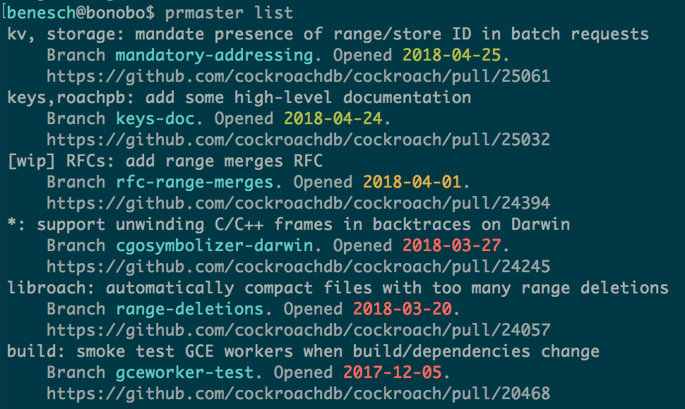

# [WIP] prmaster

CLI PR management for OCD developers.

## Usage

```shell
$ GO111MODULE=off go get -u github.com/benesch/prmaster
$ prmaster <list|sync>
```

Pretty self explanatory. More information to come.

## Example

Running in [cockroachdb/cockroach]:



```shell
$ prmaster sync
Skipping better-gce-sync. Not associated with any PRs.
Skipping cgosymbolizer-darwin. PR #24245 is still open.
Skipping gceworker-test. PR #20468 is still open.
Deleted local keys-doc. PR #25032 is closed.
Deleted remote keys-doc. PR #25032 is closed.
Skipping logictest-sort. Not associated with any PRs.
Skipping mandatory-addressing. PR #25061 is still open.
Skipping master. Looks like a release branch.
Skipping range-deletions. PR #24057 is still open.
Skipping rfc-range-merges. PR #24394 is still open.
Skipping role-patch. Not associated with any PRs.
Skipping srf. Not associated with any PRs.
Skipping xmake. Not associated with any PRs.

These remote branches do not have open PRs:
    better-gce-sync
    logictest-sort
    range-merges
    role-patch

    Manage: https://github.com/benesch/cockroach/branches/yours

These local branches do not exist on your remote:
    srf
    xmake

Running `git remote prune origin`.
```

[cockroachdb/cockroach]: https://github.com/cockroachdb/cockroach
